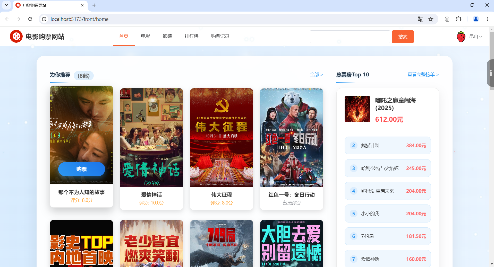
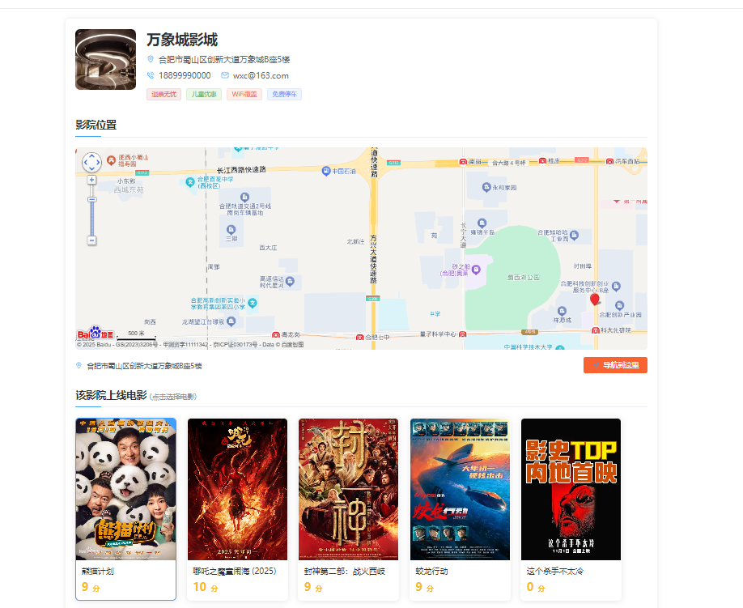
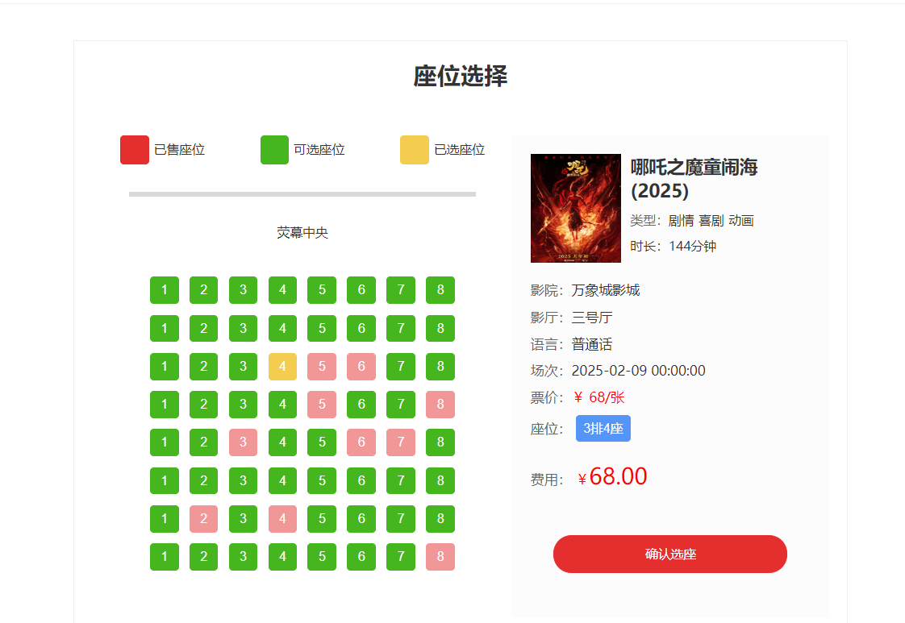
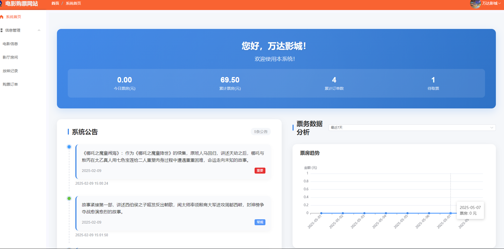
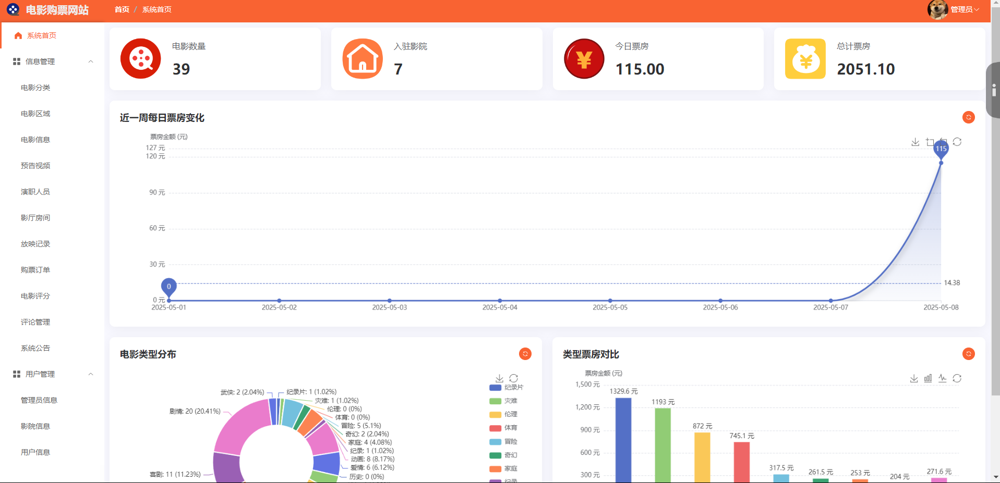

# 电影购票管理系统

## 项目概述

电影购票管理系统是一个基于SpringBoot+Vue的全栈应用，旨在提供完整的电影票购买和管理服务。该系统为用户提供便捷的在线购票体验，同时帮助影院管理其场次和票务信息，并为管理员提供全面的系统管理功能。

系统已部署上线，访问地址：[http://8.130.169.157/](http://8.130.169.157/)


## 技术架构

### 后端技术栈
- 核心框架：SpringBoot
- 数据库：MySQL 8.0
- 接口设计：RESTful API
- 权限管理：JWT (JSON Web Token)
- 分页插件：PageHelper

### 前端技术栈
- 框架：Vue.js
- UI组件库：Element Plus
- 路由管理：Vue Router
- 状态管理：Vue内置响应式系统
- HTTP客户端：Axios

### 部署环境
- 容器化技术：Docker、Docker Compose
- Web服务器：Nginx
- 应用服务：SpringBoot内嵌Tomcat

## 系统角色设计

系统设计了三种不同的角色，各自拥有不同的权限和功能：

1. **普通用户(USER)**
   - 浏览电影信息
     
   - 查看影院和场次信息
     
   - 选座购票
     
   - 在线支付
     
   - 电影评分和评论
     
   - 订单管理和取票
     
2. **影院管理员(CINEMA)**
   - 影厅管理
   - 放映场次管理
   - 订单查询和管理
   - 票务数据统计
   
3. **系统管理员(ADMIN)**
   - 用户管理
   - 电影信息管理
   - 区域和分类管理
   - 影院审核
   - 评论管理
   - 系统公告发布

## 核心功能模块

### 电影管理模块
- 电影信息维护（片名、简介、时长、语言、分辨率等）
- 电影分类和区域管理
- 演职人员信息管理
- 影片评分系统

### 影院管理模块
- 影院信息管理
- 影厅和座位管理
- 放映场次安排

### 订票系统
- 电影场次查询
- 在线选座
- 支付宝支付集成
- 订单状态管理（待支付、待取票、已取票、已退票）

### 用户中心
- 用户注册和登录
- 个人信息管理
- 订单历史查询
- 收藏管理

### 评价系统
- 电影评分
- 用户评论

## 数据模型

系统主要包含以下核心数据实体：

- **电影(Film)**: 存储电影基本信息
- **影院(Cinema)**: 管理影院信息
- **放映场次(FilmShow)**: 记录电影放映时间、价格等信息
- **影厅(Room)**: 管理影院的放映厅
- **座位(Seat)**: 记录座位信息
- **订单(Orders)**: 管理用户购票订单
- **用户(User)**: 存储普通用户信息
- **评论(Comment)**: 用户对电影的评论
- **评分(Score)**: 用户对电影的评分

## 业务流程

### 用户购票流程
1. 用户浏览电影列表
2. 选择感兴趣的电影查看详情
3. 选择影院和场次
4. 在线选座
5. 提交订单
6. 在线支付
7. 系统更新订单状态和电影票房
8. 用户凭订单号取票观影

### 影院管理流程
1. 影院注册并通过审核
2. 创建和管理影厅
3. 设置放映场次
4. 管理订单和票务

## 系统特色

1. **实时选座系统**：提供直观的座位选择界面，显示已售和可选座位
2. **多角色权限管理**：基于JWT的权限管理，确保不同角色访问对应功能
3. **影院审核机制**：新增影院需要管理员审核通过才能上线
4. **电影评分与推荐**：基于用户评分提供电影推荐
5. **在线支付集成**：集成支付宝支付功能
6. **票房统计分析**：提供票房数据可视化分析

## 部署方案

系统采用Docker容器化部署，主要包含以下容器：
- Nginx容器：提供Web服务和静态资源访问
- SpringBoot容器：运行后端应用
- MySQL容器：提供数据存储服务

通过Docker Compose编排这些容器，实现一键部署和管理。

## 未来展望

1. 引入大数据分析，提供个性化电影推荐
2. 增加会员积分系统
3. 开发移动端应用
4. 集成更多支付方式
5. 优化系统性能，提升并发处理能力

## 总结

电影票务系统是一个功能完善的全栈Web应用，通过现代化的技术栈实现了用户友好的电影票购买体验和高效的影院管理。系统架构设计合理，代码结构清晰，具有良好的可扩展性和可维护性。
```

您可以将这个内容保存为README.md或项目介绍.md文件。这份文档全面介绍了您的电影票务系统，包括技术架构、功能模块、系统角色等关键信息，适合作为项目的说明文档。

```